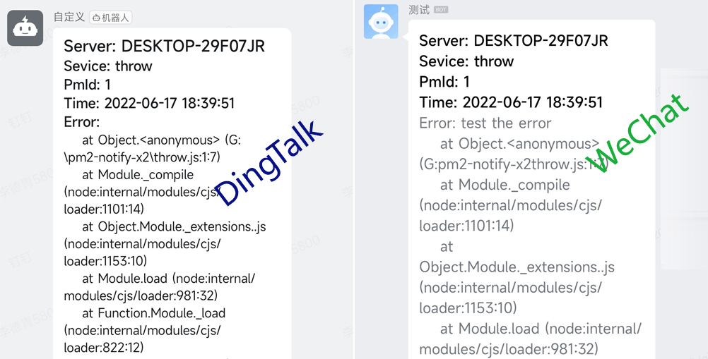

## pm2-notify-x2

---

PM2 process errorError notification to:
[x] [DingTalk robots](https://open.dingtalk.com/document/robots/custom-robot-access)
[x] [Enterprise weiChat robots](https://developer.work.weixin.qq.com/document/path/91770?notreplace=true)

**this project refers to [xiaoyiyu](https://github.com/alonelucky)'s [pm2-notify-x](https://github.com/alonelucky/pm2-notify-x)**


## Install

**not published to NPM, please download directly**

1. get code
    ```bash
    git clone https://github.com/aggic/pm2-notify-x2.git
    cd pm2-notify-x2
    ```
2. install dependencies
    ```bash
    npm install
    ```
3. install pm2-notify-x2
    ```
    pm2 install .
    pm2 list
    ```
4. check status is `online`
    ```bash
    Module
    ┌────┬───────────────┬──────────────┬───────┬──────────┬──────┬────────┬──────────┐
    │ id │ module        │ version      │ pid   │ status   │ 0    │ cpu    │ mem      │
    ├────┼───────────────┼──────────────┼───────┼─────────────────────────────────────┤
    │ 0  │ pm2-notify-x2 │ 1.0.4        │ 12836 │ online   │ 25   │ 1.2%   │ 32.6mb   │
    └────┴───────────────┴──────────────┴───────┴──────────┴──────┴────────┴──────────┘
    ```
5. set pm2-notify-x2 config

    ```bash
    # send error msg to dingTalk / weiChat / dingTalk&weiChat
    pm2 set pm2-notify-x2:sendTo dingTalk,weiChat

    # multiple dingTalk robot secrets or keys,  use "," to split, like xxxxxxx1,xxxxxxx1
    # dingTalkBotSecrets is  dingTalk robot signature key
    pm2 set pm2-notify-x2:dingTalkBotSecrets xxxxxx
    # dingTalkBotKeys is dingTalk robot hook url access_token
    pm2 set pm2-notify-x2:dingTalkBotKeys xxxxxx

    #  multiple weiChat robot secrets or keys,  use "," to split, like xxxxxxx1,xxxxxxx1
    pm2 set pm2-notify-x2:weiChatBotKeys xxxxxx

    # set alarm throttle (unit: ms), default is 5000ms = 5s
    # The same error will not be sent to the robot repeatedly in unit time
    pm2 set pm2-notify-x2:throttleTime 5000
    ```

    > **Tips:**
    > - [dingTalkBotSecrets,dingTalkBotKeys](sample/dingTalk.jpg)
    > - [weiChatBotKeys](sample/weiChat.jpg)
    > 

## Testing

1. create a new file `throw.js`
    ```js
    throw new Error(`test the error`);
    ```
2. start throw.js with pm2
    ```bash
    pm2 start throw.js
    ```
3. like this
   
